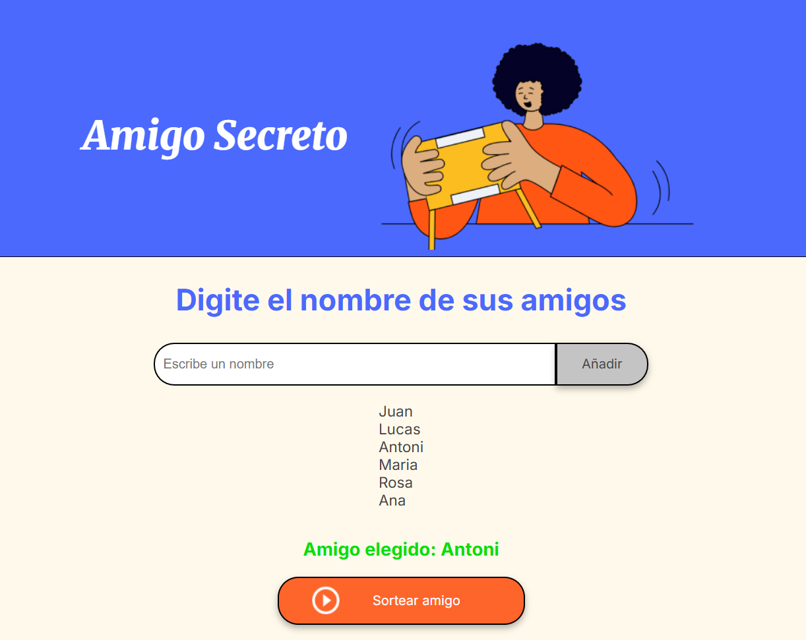

# AMIGO CHALLENGE
El siguiente proyecto muestra lo aprendido para el challenge de amigo secreto
## Descripcion de funcionamiento

1. **introduccion**
- inicialmente se muestra la paguina de inicio que va permitir ingresar los nombres de amigos y mostrarlos, luego se tiene un boton para realizar un sorteo y aleatoriamente se elejiran a un ganador y muestra

2. **funcionamiento**
- se ingresa los nombres de las personas
- en caso de que no se ingrese el nombre y se de en agregar, saldrá un aviso de que: "se debe agregar un nombre".
- terminado de registrar a los participantes, se muestra la lista en pantalla.
- se da clik en el boton sortear y se elige aleatoriamente un ganador
- en la parte inferior de la lista, se muestra el ganador con otro tamaño de letra y de color verde.
- actualizar la paguina para iniciar todo nuevamente

